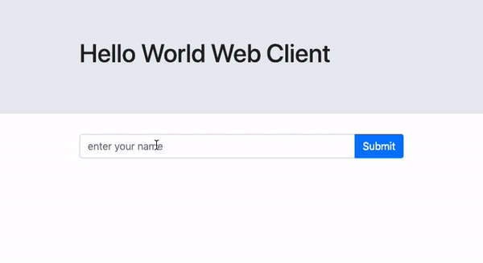

# helloworld
When we start learning a new programming language, we typically start by writing the classic “Hello, World” program. 
Here you'll get to practice doing just so with Go by building a simple Go web server along with a web client to interact 
with your server. Below is an example of what the final exercise could look like.

Instructions can be found in `./client/` and `./helloserver/`.

The original exercise is credited to [David Stearns](https://github.com/drstearns) and the material he made readily 
available by means of his INFO344 course on Server Side Development.