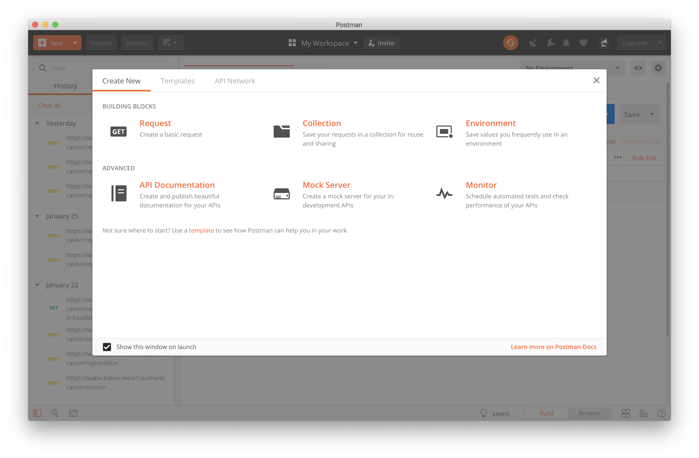
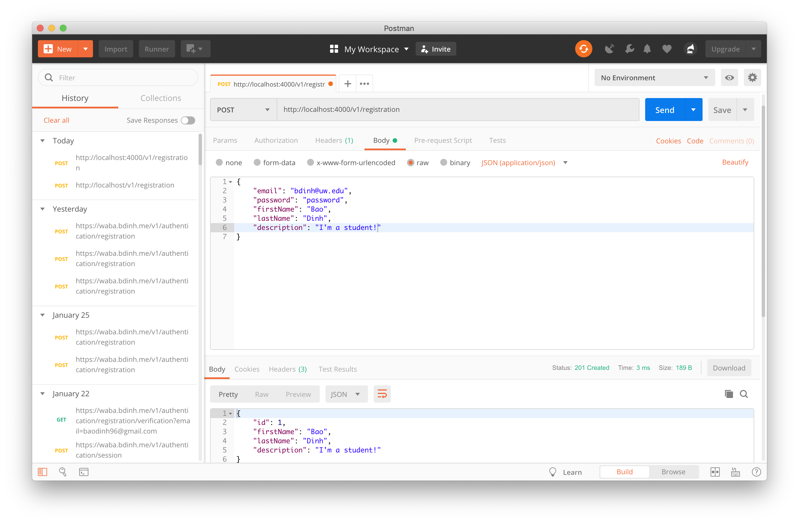
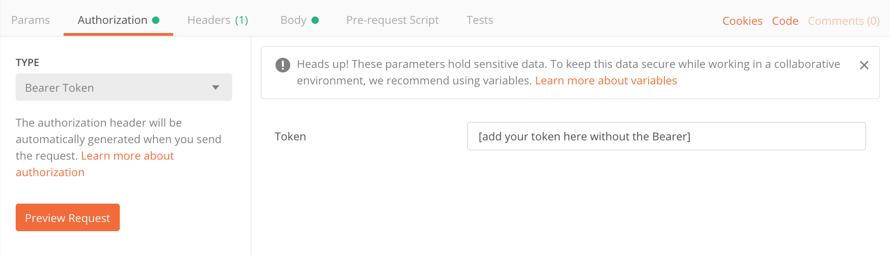

# postman

In this exercise, you'll be working with [Postman]() to test the functionalities
of a web server. No coding is required for this exercise. The provided code can be 
used as reference for `Assignment 4: Authentication Users`. Be mindful that the code
provided is not robust and was primarily written for demonstration purposes.

## Background
In this exercise, you will run a web server on your local machine. The features provided by the
web server allows a client to register for an account. Once registered, a client can also login to 
receive credentials that they can use to view or update information for that user. Below are the resource
path for each feature

`POST /v1/registration`: Takes in `JSON` that represents a new user and returns a `JSON` representation of the created user

`POST /v1/login`: Takes in `JSON` that represents user login information. Returns a token in the `Header` that can be used to view or update account information. Also returns a `JSON` representation of the current user.

`GET /v1/user/{id}`: Returns a `JSON` representation of the user's account information given an `id` (for that user) and a authorization token.

`PATCH /v1/user/{id}`: Updates the given user's first and last name and returns a `JSON` representation of that new updated user.

## Instructions 
1. Download Postman [here](https://www.getpostman.com/downloads/).
2. Navigate to this exercise's directory from within `terminal` or `git bash`. 
3. Run `go run main.go`. I've added `Print` statements that will print to `stdout` as you
make requests to the server. Have `termianl` or `git bash`  open so that you can reference
what is going on  internally. 
4. Open up Postman. Upon opening up, it should look similar to what's shown below. 
For the sake of this exercise, just close the popup.
5. Let's make our first request! Here we will make a `POST` request to `http://localhost:4000/v1/registration` in order to register a user for a new account. 
	- Add that provided `url` into the `Enter request URL` input.
	- Change the method type to be `POST`. 
	- Since this `POST` request requires that we provide `JSON` in the body, we will do so by navigating the middle navigation bar in order to access the `Body` tab. 
	- Once inside the `Body` tab, we can specify what our request body will look like. Let's change the type to `raw` and then update the default `text` option to `JSON (application/json)`. 
	- Copy the `JSON` snippet below and paste it into the input form. Change the actual values to anything you like. Data is stored in memory and thus will get wiped out after server terminates.  

	```
	{
		"email": "add any email",
		"password": "add any password",
		"firstName": "add any first name",
		"lastName": "add any last name",
		"description": "add a description "
	}
	```
	- Now you should be able to send a request to the web server.
	- Below is an example of a successful request.
	 
	- Assumely you've made a successful request, what response did you get back? 
	```
	Copy and paste the response below for participation 
	//
	//
	//
	//
	```
	
6. Now that we've registered for an account, we should be able to login with our `email` and `password`. Here we'll make a `POST` request to `http://localhost:4000/v1/login`. Postman allows you to have multiple tabs of request open. I recommend opening up a new tab (found below `My Workspace` header) for each type of request. 
	- Add `http://localhost:4000/v1/login` as your `url` for this request.
	- Make sure it's a `POST` request.
	- Add the following `JSON` snippet for the request body.
	
	```
	{
		"id": [integer representing the id of the user],
		"email": "Email you used previously",
		"password": "Password you used previously"
	}
	```
	- Send the request to the server.
	- Assumely you've made a successful request, what response did you get back? 
	
	```
	Copy and paste the response below for participation 
	//
	//
	//
	//
	```
	- Now check the `Headers` tab of the response. You'll notice there's a header called `Authorization`. Copy the value provided. It should look something like `Bearer [some string]`. This is essentially your session token that the server has provided for you in order to authenticate future request to the server. 

7. The next request we will deal with is a `GET` request to `http://localhost:4000/v1/user/{id}`. With this request, you'll be able to get information stored on the server for a particular user. 
	- The only way to be able to access this information is if we provide the server with some sort of authorization token. Using the token provided up top, we will make a request to the server by adding an `Authorization` header to our request. 	
	
	- Add your token to the input field for `Token`, without the `Bearer ` prefix. 
	- Since this is a `GET` request, you do not need to provide any request body. 
	- Send the request to the server. The server should return the account information for this particular user. 

8. This last request will be a `PATCH` request made to `http://localhost:4000/v1/user/{id}`. This part of the exericise requires that you look at the provided code and see what are all the neccessary inputs (request body) for this specific request. 

	- Assumely you've read the code and made a successful request, what response did you get back? 
	
	```
	Copy and paste the response below for participation 
	//
	//
	//
	//
