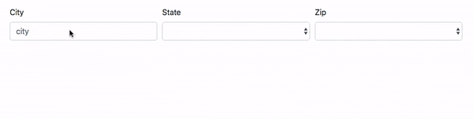

# zip
In this exercise, you will build a web client and web server that allows a user to search through a
data file of cities, states and zip codes in order to build something similar to the provided example 
below. 

In general, your web client will use the server that you built in order to populate fields based on the name of the city
entered on the client. 

Instructions can be found in `./client/` and `./server/`.

The original exercise is credited to [David Stearns](https://github.com/drstearns) and the material he made readily 
available by means of his INFO344 course on Server Side Development.

